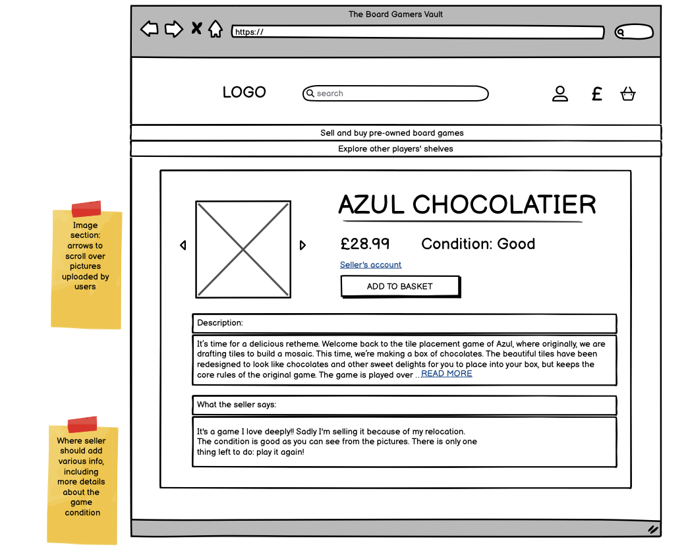

# The Boardgames Shelf

Developer: Stefania Frustagli

## App Overview

Welcome to my board game marketplace! This e-commerce platform is designed to connect board game enthusiasts looking to buy and sell used board games. Whether you’re clearing out your collection or searching for that rare gem, this site provides a user-friendly experience to meet your needs.

Sellers can list their board games, complete with details and images, and specify their location, making it easier for buyers to find games available nearby. My goal is to foster a community of gamers who can trade, sell, and discover new games with ease. 

#### Type of App: E-Commerce

The app functions as an e-commerce platform where users can list and sell their second-hand board games. Each transaction involves a single payment for the purchased game.

- **Business to Consumer (B2C)**: The app facilitates transactions directly between board game sellers (users) and buyers (customers).

- **Product Type**: Physical product - users sell their own board games.

- **Payment Model**: Single payment for each board game sold.

### Why The Boardgame Shelf?

The idea for this application stemmed from a clear gap in the market. There isn’t a dedicated, comprehensive website where board game enthusiasts can easily buy and sell used board games while managing their collections. Current platforms are fragmented and often lack the specific features needed by the board gaming community. By creating this e-commerce site, I aim to provide a centralised solution. 

My long term plan is to enable users to:
- Sell Used Board Games: list pre-owned games for sale;
- Discover Nearby Sellers: find games from sellers in a certain area;
- Catalogue Collections: in future updates, users will be able to create and manage databases of the games they own, want to sell, wish to buy, and have played;
- Review and Share: write reviews and share the gaming experiences with the community.

I would like to create a vibrant marketplace and community for board game lovers, making it easier to buy, sell, and manage board games in one place.

View the live project [here](https://the-boardgame-shelf-e0153506acf8.herokuapp.com/).

## Table of Contents 

- [Website Overview](#website-overview)
- [Project background](#project-background)
  - [Agile Development](#agile-development)
  - [Problem Statement](#problem-statement)
  - [The Design Process](#the-design-process-thinking-through-it)
  - [Colour Palettes](#colour-palettes)
  - [Fonts](#fonts)
  - [Wireframes](#wireframes)
  - [Data Model](#data-model)
- [User Experience](#user-experience)
  - [Ideal Users](#ideal-users)
  - [User Stories](#user-stories-site-accessibility--functionality)
- [Features and functionalities](#features-and-functionalities)
  - [Current Features](#current-features)
  - [Future Features](#future-features-and-general-aspects-left-to-implement)
- [Technologies used](#technologies-used)
- [Testing](#testing)
- [Deployment](#deployment)
- [Credits](#credits)

## Project background

### Problem Statement

I've noticed that among board gamers, 'fanatic' collecting is common, and buying games is almost a compulsive act. It's also common for them to get rid of games they don't play anymore. Instead of using eBay, I wanted to create a specific place for buying and selling second-hand games and to create a library of board games. There isn’t a dedicated, comprehensive website where board game enthusiasts can easily buy and sell used board games while managing their collections. Current platforms are fragmented and often lack the specific features needed by the board gaming community.

**Proposed solution**: 
With the creation of this platform, I aim to fill this gap and provide a centralized solution. 

### Business Organization
The business organization concerning sales is currently in its draft stages and not fully defined yet. One model could be to operate similarly to eBay, initially taking a percentage of each sale. In the future, I may explore implementing a subscription-based mechanism.

**Rationale**
This decision to adopt a commission-based model akin to eBay reflects a practical approach I would like to adopt, aimed at  generating revenue from transactions while providing value to my users. This model could allow me to ensure sustainability as I grow. As I evolve, I may explore additional monetization strategies, such as subscription services, to offer enhanced features and benefits to the community of board game enthusiasts.

#### Business goal

My goal is to create a portal where board game players can sell their second-hand games and - this will be a future feature - manage their collections within a comprehensive database. Creating an intuitive, user-friendly, and visually appealing app is the primary objective.

#### Strategies
Some of the marketing strategies I plan to implement include:

- **Search Engine Optimization (SEO)**: Optimizing the website content to rank higher in search engine results for relevant keywords.

- **Content Marketing and Social Media Marketing**: Creating compelling online content on Instagram, Facebook, and TikTok. This includes engaging posts about games, captivating images of board games, coverage of conventions, and highlights of second-hand games available on the website.

- **Design**: Emphasizing a visually appealing and functional design to enhance user experience.

- **Social Media Marketing**: Focusing on organic growth strategies to build a community of board game enthusiasts.

- **Email Marketing**: Utilizing email campaigns to inform users about new second-hand games available for sale and other updates.

- **Collaborations and Affiliate Marketing**: Partnering with board game creators and exploring affiliate marketing opportunities to expand outreach and user engagement.

#### Initial Budget
In the beginning, I'll use low-cost marketing strategies. If things go well, I might invest more to grow the business into something bigger.

### SEO Implementations

#### SEO Keywords

To optimize the website for search engines, common keywords related to board games were researched and utilized. I brainstormed several words with the intent to ensure that board game enthusiasts can find the website. The common words were identified using Google search engine results.

The initial list of keywords included:

Board game geek,
Board game arena,
Board games bazaar,
Board games market,
Board game catalogue,
Sell your board games,
Used board games,
Buy board games,
Popular board games,
Board games geek,
Second-hand board games,
Sell your own game,
Best way to sell board games in UK,
Board game store near me,
BGG marketplace,
Virtual flea board games market,
Board game arena

Selection: Keywords were selected based on their relevance and potential to attract board game enthusiasts. Even if some keywords were not strictly relevant, they were kept to ensure maximum visibility.

**Final Keyword List**: 

- Boardgame marketplace
- Board game shelf
- Board game shop near me
- Board game geek
- Board games market
- Second-hand board games
- Sell board games
- Used board games
- Buy board games

I think that these keywords cover a broad range of relevant search terms to ensure the site is visible to users searching for board games online.


### Marketing Strategy 
Even though the website can be used by anyone who wants to sell board games, I have a specific market in mind: those who have large collections of board games, stay up-to-date with new releases and buy games compulsively. As a regular member at various board game clubs, I know that dedicated board game players and collectors currently lack a decent place to sell and buy second-hand games, apart from Facebook groups. Moreover, they don’t have a platform to share and update their collections. My goal here is to create a platform similar to Goodreads, but for board games, and attract all the board games enthusiasts.

To start, I will focus on organic social media marketing, creating Social Media Accounts:
- I will open Instagram, Facebook, and TikTok accounts to advertise the website;
- I will start following all the board game pages I know.

#### Users and relevant platforms

My ideal users would mainly be ‘nerds’ and geeky individuals, spanning various age groups, who may use different social media platforms. Based on my experience and observations, marketing the website on Instagram, Facebook, and TikTok will effectively reach them.

**Age Group (45-60 years)**:
- Primarily use Facebook.
- Strategy: Engage with Facebook groups and pages dedicated to board games.

**Age Group (25-35 years)**:
- Prefer Instagram. Facebook can be used as well.
- Strategy: Use visually appealing content on Instagram and Facebook.

**Age Group (25-35 years)**:
- Prefer Instagram and TikTok.
- Strategy: Create engaging short-form videos on TikTok to attract this demographic.

By focusing my marketing efforts on these platforms and considering user behaviors, I aim to create a vibrant community of board game enthusiasts.

#### Possible ideas tailored to each platform:

1. **Instagram:**
   - Showcasing high-quality images of popular board games along with brief descriptions and prices;
   - Creating carousel posts featuring before-and-after images of well-loved board games being sold on the platform, highlighting the value of buying second-hand;
   - Sharing user-generated content by reposting photos of customers enjoying board games purchased from the website. Encouraging users to tag the account and use a specific hashtag to be featured;
   - Utilising Instagram Stories to announce new arrivals and share behind-the-scenes glimpses of the business;
   - Collaborating with board game influencers or creators to reach a wider audience and gain credibility within the community.

2. **Facebook:**
   - Sharing informative and engaging blog posts or articles related to board games, such as "Top 10 Board Games to Play This Summer" or "How to Host the Ultimate Game Night";
   - Hosting live Q&A sessions or virtual game nights where followers can interact with me/the team, discussing our favorite board games;
   - Creating polls or quizzes related to board games to encourage interaction and foster a sense of community among your followers.

3. **TikTok:**
   - Creating short and catchy videos showcasing the process of listing a board game for sale on your website, including features like photos, descriptions, and pricing.
   - Filming quick tutorials or tips on how to play popular board games, adding a link to the website where users can find those games for sale;
   - Jumping on trending challenges or hashtags on TikTok and incorporate them into your content in a creative way that relates to board games;
   - Collaborating with board game influencers or creators to reach a wider audience.


### The design process


### Fonts

The font used is called Poppins.
It was imported using Google fonts.

### Colour palettes


### Wireframes

**Homepage** [Desktop and mobile]:


About page [Desktop and mobile]:


Register page [Desktop and mobile]:


Login page [Desktop and mobile]:

 .
  
**Basket page** [Desktop and mobile]:


**User Account page** [Desktop and mobile]:


**Board game description page** [Desktop and mobile]:




### Data Model 

EXPLAIN THE RELATIONSHIP BETWEEN THE MODELS

The structure of our database was illustrated using an Entity-Relationship Diagram (ERD). This diagram shows how different entities within the system are related to each other and helps in understanding the data flow. 

**Entity-relationship diagrams (ERD)**

First draft:


**Models** for the first draft:

1. **User Profile**: 
   - This model extends Django's built-in User model to include additional fields like a profile picture, contact information.
   - This model represents both buyers and sellers.

2. **Game**:
   - This model represents individual board games available for sale.
   - Attributes: 
     - Title
     - Description
     - Image (for the cover or a picture of the game)
     - Price
     - Condition (e.g., new, used - you might want to use choices for this)
     - Seller (ForeignKey to User Profile)

3. **SellerAccount**: 
   - This model represents the seller's account information.
   - Attributes:
     - User (OneToOneField to User Profile)
     - Payment information (could include fields like PayPal email, bank details, etc.)

4. **BasketItem**:
   - This model represents items added to a user's basket.
   - Attributes:
     - User (ForeignKey to User Profile)
     - Game (ForeignKey to Game)
     - Quantity
     - Total price (could be calculated based on the quantity and the game's price)


Draft flowchart for apps organisation:


Current flowchart for apps organisation: 

DA AGGIUNGERE VERSIONE AGGIORNATA

The project is organized into several Django applications, trying to keep functionalities tidy and separated. As this is my second project with Django, I have decided to follow a similar structure to the one used in Boutique Ado walkthrough with Code Institute. 

The **applications** used are:

- Main app: **board_gamers_vault**

  This is the main application of the project, responsible for:
  - Project-level settings
  - URL routing
  - Global templates
  - Static files

- **Home**

  This application manages the homepage and other static content pages, providing users with information about the platform, including contact information, about us, and other informational sections. This will be further developped in the future. 

- **Marketplace**

  The Marketplace application handles all functionalities related to the e-commerce store, including:

  - Models for games
  - User profiles
  - Seller accounts
  - Basket items
  
  This is where users can browse, search, and purchase board games. Sellers can manage their products, and all e-commerce-related operations are conducted here.

- **Bag**

    The Bag application manages the shopping cart functionality, allowing users to add, remove, and view items they intend to purchase.

- **Checkout**

  The Checkout application handles the order processing, payment, and order confirmation. It ensures a smooth transaction experience for users completing their purchases.

- **Profiles**

  The Profiles application is responsible for user authentication and profile management. It includes functionalities for:

  - User registration
  - User login/logout
  - Profile editing
  - Viewing order history
  - Other user-related activities


## User Experience

#### Ideal users: 

- Board Game Shopper: 
  
  A board game enthusiast looking to expand their collection with pre-owned games or find rare and out-of-print titles. This user values affordability and the opportunity to discover unique games from other collectors.
  Needs:
  - A wide selection of pre-owned board games.
  - Detailed product information including price, condition, and images.
  - Trustworthy seller information to ensure secure transactions.
  - Convenient search and filter options to easily find specific games.
  - An easy-to-use shopping cart and checkout process.
  - Order confirmation and tracking capabilities.
  Options to save favorite games and receive notifications on game availability.

- Board Game Seller

  A board game collector or enthusiast looking to downsize their collection, make room for new games, or simply pass on games they no longer play. This user values a straightforward and efficient platform to list and sell their games.
  
  Needs:
  - An intuitive interface for listing and managing board games for sale.
  - Tools to add detailed descriptions, prices, and images of the games.
  - Visibility to potential buyers, including search optimization.
  - Easy communication with buyers to arrange sales and handle inquiries.
  - Features to update, edit, or remove listings as needed.
  - Sales management tools to keep track of inventory and transactions.

- Board Game Collector (more suitable with future features)
  
  An avid board game collector who likes to keep track of their collection, wishlist, and games they've played. This user appreciates a platform that helps them organize and showcase their collection.
  
  Needs:
  - A personalized database to catalogue owned games, games for sale, and games on their wishlist.
  - The ability to mark and review games they've played.
  - Options to make their collection public or private.
  - Social features to connect with other collectors and share reviews and recommendations.

- Casual Board Gamer
  
  Someone who enjoys playing board games occasionally and is looking for specific titles to enhance their game nights. This user prefers a simple, hassle-free buying experience.
  
  Needs:
  - Easy navigation and search functionality to quickly find games.
  - Clear and concise product information.
  - Affordable pricing and options for gently used games.
  - An uncomplicated checkout process.
  - Reliable delivery.

#### As a developer, I expect:

- User-Centric Design:
  - To focus on creating intuitive, accessible, and visually appealing interfaces that enhance user engagement and satisfaction.  
  - To create a user feedback mechanisms to gather insights and make data-driven improvements to the platform.
- Performance and Security:
  - To adhere to security best practices to protect user data and prevent vulnerabilities, maintaining user trust.

### Agile Development

The development process for this project followed Agile methodology, emphasizing continuous improvement throughout the development lifecycle.

**Project Management**: I utilised GitHub Project boards to manage tasks, user stories, and project progression effectively.

DA MODIFICARE

**User Stories**: User stories were categorized in a Kanban Board into EPICs A, B, C, D, E, and F based on user types and content specificity. I prioritized user stories using the MoSCoW method, which categorizes requirements into Must have, Should have, Could have, and Won't have categories based on their importance and urgency.

[Link to the GitHub Project board]()

**Continuous Improvement**: Despite working solo on this project, I actively sought ways to enhance development processes and product quality. Regular retrospectives allowed me to reflect on past work, pinpoint areas for improvement, and brainstorm solutions.

### User Stories

**[EPIC A] View and navigation**

A1 - As a board games shopper, I want be able to view a list of products available to purchase so that I can select the ones I want.

A2 - As a board games shopper, I want be able to view individual product details so that I can identify the price, description, product condition and product image.

A3 - As a board games shopper, I want to be able to easily view the total of my purchases at any time so that I can keep track of my spending and avoid overspending.

A4 - As a board games shopper, I want be able to access a 'search bar' so that I can see if the game I'm looking for is available.

**[EPIC B] Registration and user account**

B1 - As a site user, I want to be able to easily register for an account so that I can have a personal account and view my profile.

B2 - As a site user, I want to be able to easily login or logout so that I can access my account securely.

B3 - As a site user, I want to be able to easily recover my password so that I can always recover access to my account.

B4 - As a site user, I want to be able to receive an email confirmation after registering so that I can verify that my account registration was successful. 

B5 - As a site user, I want to be able to have a personalised user profile so that I can view my personal order history, order confirmations, and save my payment information. 

B6 - As a site user, I want to have a public account that other users can access to see if I'm currently selling any games and my board games collection.

**[EPIC C] Sorting and searching**

C1 - As a board games shopper, I want to be able to search for a product by name so that I can easily find a specific game I'd like to purchase.

C2 - As a board games shopper, I want to be able to sort a specific game by name so that I can easily find the best-priced or in best-condition specific game available.

C3 - As a board games shopper, I want to be able to easily see what I've searched for and the number of results so that I can quickly decide whether the product I want is available.

C4 - As a board games shopper, I want to have convenient access to seller information so that I can feel confident about their credibility.

**[EPIC D] Purchasing and checkout**

D1 - As a board games shopper, I want to be able to easily select the item so that I can identify the total cost and the number of items I will receive.

D2 - As a board games shopper, I want to be able to view the items in my bag so that I can make sure that my purchase is correct.

D3 - As a board games shopper, I want to view an order confirmation after checkout so that I can verify that all is correct.

D4 - As a board games shopper, I want to receive an email configuration after checking out so that I can keep the confirmation of what I've purchased for my records.

**[EPIC E] - Sale admin and store management**

E1 - As a board games seller, I want to easily navigate to my sale account from which I can organise the products I intend to sell.

E2 - As a board game seller, I want the option to add one or more board games to sell so that I can sell more items at once.

E3 - As a board games seller, I want to edit/update availability of a product so that I can change product criteria, like price, descriptions and images.

E4 - As a board games seller, I want to be able to delete a product so that I can specify that that product is no longer available for sale.


## Features

### Current Features


#### Navbar


The navigation links are: 


#### Authentication and notification messages
Users can see their log status below the navigation bar. The following message will appear to the right of the acreen if users are logged in:

"You are logged in as [username]" 

Otherwise, a message stating they are not logged in will apprear, with a link:

"You are not logged in.
Log *here*."

Below the navigation bar will also appear other notifications, such as sign out, edits and deletions of comments.

Example:


#### Footer
On every page, the footer displays 
ADD


#### Homepage


#### Register page
The Register page, which is visible to non-logged-in users, presents a registration form. The mandatory fields are 'Username' and 'Password' (to be entered twice), while the optional field is 'Email' address.


In addition, it contains a link that leads to the Login page, if the user has already created an account.

#### Sign in page
The Sign in page allows registered users to sign into their account by entering their username and password. It also contains a link to the Register page, if the user hasn't created an account yet.


Also, users have the option of having their login information remembered, so they don't have to re-enter their login details each time they visit the website.

#### Logout page
The logout page allows users to log out of their accounts. The user must confirm their choice. They  can also cancel the action and return to the homepage.


#### About page
This page outlines the purpose of the website and my role as a creator. The purpose of my short presentation is to establish trust with the viewer and to explain the current state of the website in a clear and concise manner.


#### Django admin board
The admin board allows administrators to control the website. They can add topics and contents, edit the About section and authorise comments to be published.


In the admin board, it is also possible to control users' permissions, deactivate their accounts or make them admin users.

The functionalities are still basic and will be improved in the future.

#### Favicon
The favicon was generated using [Microsoft Designer](https://designer.microsoft.com/image-creator). It features an image of a wizard about to cast a spell in front of a suitcase containing a book and various dice, surrounded by numerous objects and artifacts.


It was converted to a favicon using [favicon.io](https://favicon.io/favicon-converter/)

#### Error pages
The error pages simply provide the user with a link back to the homepage and inform them what type of error they encountered.

#### Social media currently set up

A Facebook page has been created for the application. This page will be used to share updates, engage with the community, and provide support to users.


Find the FB page [here](https://www.facebook.com/profile.php?id=61561423170621).


### Future Features and general aspects left to implement

Future features will include personalized databases where users can catalogue their collections, track their wish lists, log played games, and share reviews, creating a comprehensive hub for all things board games.


## Technologies used

### Programming Languages

- Programming languages used in this project are **HTML5**, **CSS3**, **JavaSctipt** and **Python**.

### Frameworks and Libraries

- [Bootstrap:](https://getbootstrap.com/) Bootstrap CSS Framework used for styling and to build responsive web pages;
- [Django:](https://www.djangoproject.com/) Main Python framework used in the development;
- [Django Allauth:](https://django-allauth.readthedocs.io/en/latest/index.html) Used for authentication and account registration;
- [Django Crispy Forms:](https://django-crispy-forms.readthedocs.io/en/latest/) Used to simplify the rendering of Django forms.
- [Gunicorn:](https://gunicorn.org/) Python HTTP server, used as the Web Server to run Django on Heroku;
- [Summernote:](https://github.com/summernote/django-summernote) To provide a WYSIWYG editor for customizing new blog content and add images.

### Software and Web Applications

- [Code Institute Postgres database](https://dbs.ci-dbs.net) was the Database used for this application.
- [Chrome DevTools:](https://developer.chrome.com/docs/devtools/) Used to test the response on different screen sizes, debugging and to generate a Lighthouse report to analyze.
- [PEP8](http://pep8online.com/) was used to check the code for PEP8 requirements.
- [HTML Validator:](https://validator.w3.org/) Check your code for HTML validation.
- [JSHint:](https://jshint.com/) Check code for JavaScript validation.
- [W3 CSS Validator:](https://jigsaw.w3.org/css-validator/) Check your code for CSS validation.
- [Code Beautify - Python Beautifier](https://codebeautify.org/python-formatter-beautifier) was used to format the code.
- [Heroku: Cloud Application Platform](https://dashboard.heroku.com/apps) was used for the deployment.
- [Git](https://git-scm.com/) was used for version control by utilising the Gitpod terminal to commit to Git and Push to GitHub.
- [GitHub](https://github.com/) was used as the repository for the project after being pushed from Git.
- [VSCode](https://code.visualstudio.com/) was used as the primary local Integrated Development Environment (IDE) for coding and development.
- [Lucidchart](https://www.lucidchart.com/pages/) was used to create a draft flowchart during the planning process.
- [ImgBB](https://imgbb.com/) was used to upload images and extract the source code.
- [Am I Responsive?](http://ami.responsivedesign.is) was used to generate the mockup of the website.
- [Table Convert](https://tableconvert.com/) was used to generate tables for the TESTING.md file.
- [ChatGPT](https://chat.openai.com/) was used as helpful tool during the debugging process.
- [Microsoft Designer](https://designer.microsoft.com/image-creator) was used to create images for the project.
- [Favicon.io](https://favicon.io/favicon-converter/) was used to convert the chosen image into the favicon.

## Modules imported

TO BE ADDED

## Testing

Testing information can be found in [TESTING.md file](TESTING.md).

## Deployment

Heroku was used to deploy the site. Here are the steps to deploy:

1. Log in to Heroku.
2. Click "Create a new app".
3. Choose the app name and region.
4. Click "Create app".
5. Navigate to the "settings" tab.
6. "Click "Reveal Config Vars".
7. Add a configuration variable to Heroku's Settings. The key is PORT and the value is 8000
8. Scroll down to "Buildpacks".
9. Click "Add Buildpack".
10. First, add "python" and click save.
11. Second, add "nodejs" and click save.

The live site can be found here: [Narcissistic Website](https://narcissism-website-8191a44972de.herokuapp.com/) 

### Cloning:

1. Click the "Code" button in the GitHub repository.
2. Choose "HTTPS" and copy the URL.
3. Open the Terminam (in macOS) or Git Bash (in Windows) and navigate to the repository where you would like to locate the cloned repository.
4. Type "git clone" followed by the copied URL.
5. Press enter to create the clone.

### Forking

You can fork this project and make a copy of the original repository in your own GitHub account. In this case, you can view or make changes without affecting the original. To do so:

- log into GitHub and locate the GitHub Repository;
- at the top right of the screen, click the Fork button.

It should be noted that all changes pushed to the main branch are automatically reflected on the site.

## Database creation
The database used is PostgreSQL.

### How to get started:
1. Go to https://dbs.ci-dbs.net/
2. Input email address and click Submit;
3. The Database will be created and the details emailed;
4. You will need the DATABASE_URL to connect the database to your project.

### How to connect the database to the project:
1. Create a file named **env.py** at the top level of the project;
2. Open the **.gitignore** file and add **env.py** to prevent the secret data you will add to it from being pushed to GitHub.
3. In the **env.py** file, import Python's operating system module and use it to set the value of the **DATABASE_URL** constant to the URL copied from the details emailed to you - see below:
```
import os

os.environ.setdefault(
    "DATABASE_URL", "<your-database-URL>")
```
4. Pip install the two packages required to connect to your PostgreSQL database. Then add them to the requirements file:
```
pip3 install dj-database-url~=0.5 psycopg2~=2.9
pip3 freeze --local > requirements.txt
```
5. In **settings.py** import the appropriate packages and connect the **settings.py** file to the **env.py** file:
```
import os
import dj_database_url
if os.path.isfile('env.py'):
    import env
```
6. In the **settings.py** file, comment out the local sqlite3 database connection set up by default.

7. In the **settings.py** file, connect to the environment variable **DATABASE_URL** you previously added to the **env.py** file:
```
DATABASES = {
    'default': dj_database_url.parse(os.environ.get("DATABASE_URL"))
}
```
8. Your project is now connected to the database and you can create database tables with Django's **migrate** command.

## Credits

### Content

TO BE ADDED


### Code

The code was mainly based on Code Institute's walkthrough TO BE ADDED

### Acknowledgment

I am grateful to my mentor Brian Macharia for his suggestions and to my classmate Niclas for his precious support. A special thanks goes to the amazing tool that is ChatGPT: it helped me with the debugging process and whenever I got stuck.
